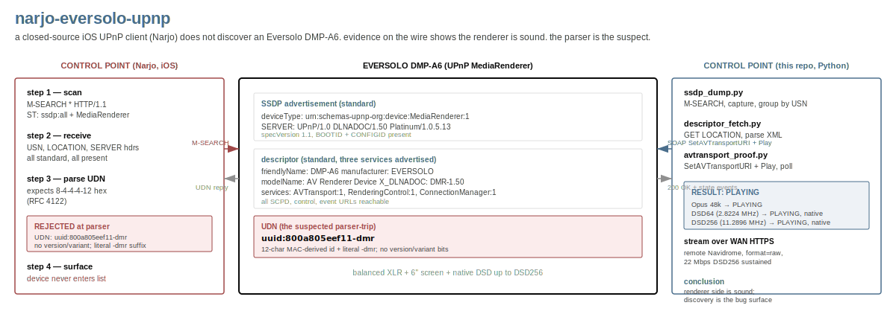
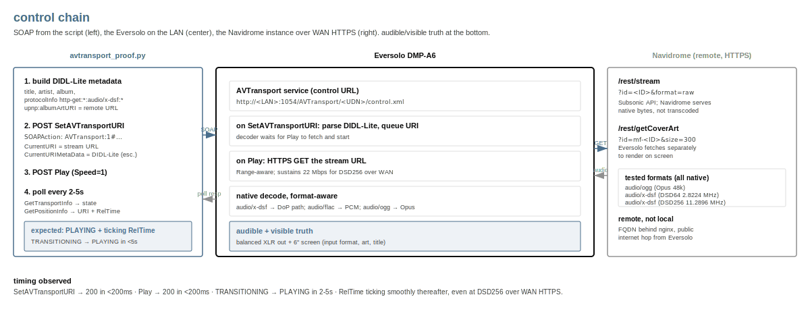

# narjo-eversolo-upnp

[](LICENSE)


> Hello @Deku, give us source access and we'll contribute well, we
> promise. Until then, here's a debug bundle so you don't have to do
> this yourself.

Narjo, a closed-source iOS Subsonic-API client, does not discover the
Eversolo DMP-A6 Master Gen 2 as a [UPnP][upnp] renderer. mconnect
Player and other generic control points discover it fine. So I
captured what the Eversolo advertises on the wire and proved
direct SOAP drives the renderer end-to-end. The renderer is sound.
The likeliest parser trip is the Eversolo's UDN, which is not an
[RFC 4122][rfc4122] UUID.

[upnp]: https://en.wikipedia.org/wiki/Universal_Plug_and_Play
[rfc4122]: https://datatracker.ietf.org/doc/html/rfc4122

## Headline finding

- **Eversolo advertises standard `MediaRenderer:1`** with all three
  expected services (`AVTransport`, `RenderingControl`,
  `ConnectionManager`). UPnP 1.1, Plutinosoft Platinum SDK 1.0.5.13.
- **Direct SOAP drives the renderer end-to-end.** `SetAVTransportURI` +
  `Play` reaches `PLAYING`, and three runs span Opus 48 kHz, DSD64 (2.8
  MHz), and DSD256 (11.3 MHz) with native passthrough confirmed
  on-device. Stream source was a remote Navidrome over WAN HTTPS.
- **The UDN is non-conforming.** `uuid:800a805eef11-dmr`: 12-char
  MAC-derived id plus a literal `-dmr` suffix, no version or variant
  bits. Any control-point code that validates the UDN as RFC 4122 (a
  `UUID(...)` constructor, an 8-4-4-4-12 regex, a `Foundation.UUID`
  cast on Apple platforms) drops the device before it reaches the user
  list.

<details>
<summary><b>Evidence on the wire</b></summary>

### SSDP advertisement

Captured by `ssdp_dump.py` (M-SEARCH multicast on `239.255.255.250:1900`,
listening 8 seconds). Full output in `ssdp_dump.txt`. Highlights:

```
USN:      uuid:800a805eef11-dmr::urn:schemas-upnp-org:device:MediaRenderer:1
LOCATION: http://<EVERSOLO_IP>:1054/description.xml
SERVER:   UPnP/1.0 DLNADOC/1.50 Platinum/1.0.5.13
BOOTID.UPNP.ORG:   1778188637
CONFIGID.UPNP.ORG: 9435121
```

Six USN entries advertised (the base UDN, `upnp:rootdevice`, the
`MediaRenderer:1` device type, and one per service), all sharing the
same UDN base `uuid:800a805eef11-dmr`.

### Device descriptor

Captured by `descriptor_fetch.py`. Full XML in `eversolo_descriptor.xml`,
parsed summary in `eversolo_descriptor_summary.md`. Highlights:

```
deviceType:       urn:schemas-upnp-org:device:MediaRenderer:1
friendlyName:     DMP-A6
manufacturer:     EVERSOLO
modelDescription: Plutinosoft AV Media Renderer Device
modelName:        AV Renderer Device
UDN:              uuid:800a805eef11-dmr
X_DLNADOC:        DMR-1.50
services:         AVTransport:1, RenderingControl:1, ConnectionManager:1
```

`modelName: AV Renderer Device` is the Plutinosoft default, not
Eversolo-branded. A control point that allowlists `modelName` against
known-good strings (Sonos, Yamaha, Denon, etc.) drops the Eversolo here
too.

### AVTransport drives end-to-end



Captured by `avtransport_proof.py`. Full transcript in
`proof_of_chain.log`. Three runs:

| Run | Format     | Sample rate          | Bitrate     | Result                              |
|-----|------------|----------------------|-------------|-------------------------------------|
| 1   | Opus / Ogg | 48 kHz               | 129 kbps    | PLAYING, decoder ticking            |
| 2   | DSF / DSD  | 2.8224 MHz (DSD64)   | 5,645 kbps  | PLAYING, native, art on screen      |
| 3   | DSF / DSD  | 11.2896 MHz (DSD256) | 22,579 kbps | PLAYING, native, art on screen      |

All three streams come from a Navidrome instance on a public FQDN, not
the local LAN. The Eversolo fetches over WAN HTTPS using `format=raw`
(Subsonic's "no transcoding" passthrough). Native DSD passthrough
verified on the Eversolo's display (input format reported as DSD, not
PCM) and audibly on balanced XLR. The DIDL-Lite `<upnp:albumArtURI>`
rendered on the device's 6-inch screen for every test.

So on top of UPnP itself, the Eversolo handles HTTPS, DNS resolution,
sustained 22 Mbps WAN fetches, and native DSD256 decoding from a remote
source, with no buffering observed during the polled window.

</details>

<details>
<summary><b>Reproduce against your own renderer</b></summary>

Python 3 stdlib only. No `pip install`, no virtualenv.

```sh
# 1. Find UPnP devices on the LAN.
python3 ssdp_dump.py

# 2. Fetch the device descriptor from any LOCATION URL the dump returned.
python3 descriptor_fetch.py http://<DEVICE_IP>:<PORT>/description.xml

# 3. Drive the renderer directly via SOAP. Stream URL can be any
#    HTTP-accessible audio URL. For Subsonic/Navidrome, append
#    format=raw to /rest/stream for bit-perfect passthrough.
python3 avtransport_proof.py \
    --control-url 'http://<DEVICE_IP>:<PORT>/AVTransport/<UDN>/control.xml' \
    --stream-url  '<HTTP audio URL>' \
    --art-url     '<HTTP cover art URL>' \
    --title 'Track' --artist 'Artist' --album 'Album' \
    --mime audio/flac
```

`find_hires.py` is bonus: paginates Subsonic `search3` and reports
tracks at 96 kHz+ or DSD, ranked by sampling rate. Useful for picking
a stress-test target.

</details>

<details>
<summary><b>What was redacted before publishing</b></summary>

The captured artifacts had three classes of values stripped:

- Navidrome auth tokens, the salt, the local username (replaced with
  `<TOKEN>`, `<SALT>`, `<USER>`).
- The local LAN IP of the Eversolo (replaced with `<EVERSOLO_IP>`).
- Any LAN topology that wasn't relevant to the bug.

What was preserved on purpose:

- The Eversolo's UDN (`uuid:800a805eef11-dmr`). It is the central piece
  of bug evidence; UPnP USN/UDN strings are advertised on every
  multicast and aren't sensitive in isolation.
- All UPnP wire content: device type, manufacturer string, model name,
  service list, SCPD/control/event URL paths.
- The SERVER header (Platinum SDK fingerprint).

</details>

## Repository contents

| File                              | Purpose                                                           |
|-----------------------------------|-------------------------------------------------------------------|
| `ssdp_dump.py`                    | M-SEARCH multicast, captures SSDP responses, groups by USN.       |
| `descriptor_fetch.py`             | GETs a LOCATION URL, dumps device descriptor XML and a summary.   |
| `avtransport_proof.py`            | Drives a UPnP MediaRenderer end-to-end via SOAP.                  |
| `find_hires.py`                   | Optional: paginates Subsonic `search3` for tracks ≥96 kHz or DSD. |
| `ssdp_dump.txt`                   | Captured SSDP responses from the Eversolo on this LAN.            |
| `eversolo_descriptor.xml`         | Raw device descriptor XML.                                        |
| `eversolo_descriptor_summary.md`  | Human-readable parsed summary.                                    |
| `proof_of_chain.log`              | Combined transcript of all three AVTransport runs.                |
| `hero.svg`, `diagrams/`           | Diagrams used in this README.                                     |

## Acknowledgments and posture

The Narjo developer is solo and indie. The deal he proposed: he would
prioritize this if I tested thoroughly. This repo is the thoroughness.

The hypothesis here (UDN-shape rejection) is a hypothesis, not a finding
from reading Narjo's source, which is closed. The artifacts in this
repo are reality on the wire. The cause is the dev's call to confirm.

## License

[MIT](./LICENSE).
